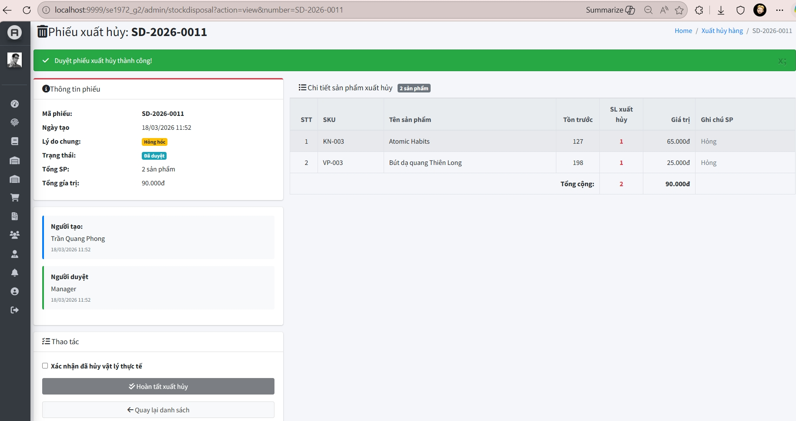
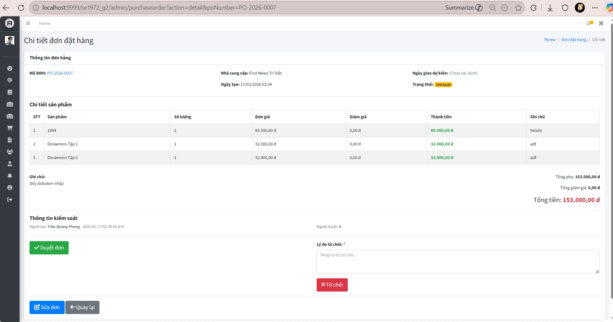
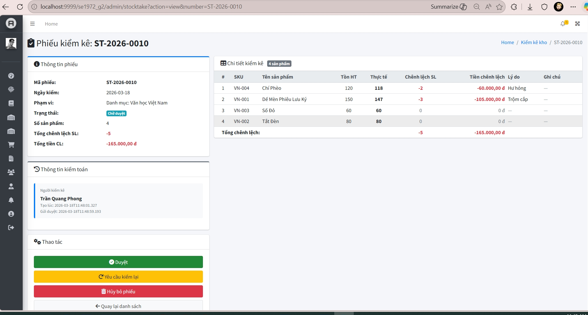
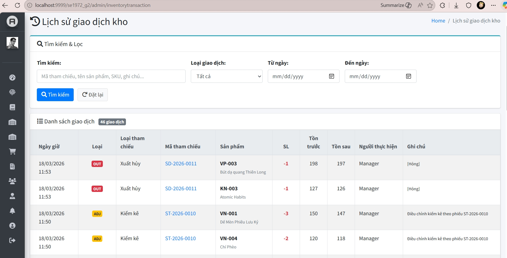

# 📚 Bookstore POS - Enterprise Management & Sales Solution

### _FPT University Capstone Project - Spring 2026_

---

## Team (SE1972_G2)

| **Member**        | **Professional Role** | **Key Module Responsibilities**                                                |
| ----------------- | --------------------- | ------------------------------------------------------------------------------ |
| **DatNX**         | **Developer**         | Product Architecture, Category & Brand Management, Public Catalog              |
| **HuyNQ**         | **Developer**         | Auth System, Employee Records, Shift Scheduling, Attendance Tracking           |
| **_PhongTQ_** | **_Developer_**         | **_Inventory Control (PO, GR, Stock Take, Disposal), Supplier & Notifications_** |
| **thanhlt**       | **Developer**         | CRM, Customer Tiering, Promotion Engine                                        |
| **Namhphh**       | **Developer**         | POS System, Revenue Analytics, Invoice & Transaction History                   |

---

## 📖 Project Overview

**Bookstore POS** is a solution designed to modernize bookstore operations. It seamlessly integrates front-desk sales (POS) with back-office logistics. Our primary focus is on **operational security**, **inventory precision**, and **anti-fraud mechanisms** to protect business margins and physical assets.

---

## 📋 Product Requirements (Module Scope)

Based on our standardized Use Case architecture, the system is divided into five critical pillars:

### 📦 Inventory & Supplier (Core Logic)

- **Purchase Order (PO):** Multi-stage planning and approval workflow.
    
- **Goods Receipt (GR):** Actual goods received into inventory and reconciliation of discrepancies with Purchase Orders (PO).
    
- **Stock Take (Audit):** Periodic auditing with "Inventory Locking" to ensure zero data corruption during counts.
    
- **Stock Disposal:** Secure workflow for handling damaged or expired goods with mandatory manager verification.
    
- **Supplier Management:** Strategic vendor database with active/inactive status controls.
    

### 🛒 POS & Sales Operations

- Optimized for high-speed checkout, supporting barcode scanning, automated promotions, and VNPAY integration.
    

### 🏷️ Product & Cataloging

- Multi-tier classification (Categories, Brands, Bundled Combos) to streamline navigation and reporting.
    

### 💎 CRM & Marketing

- Dynamic customer profiling, automated membership tiering, and targeted discount campaigns.
    

### 🕒 HR & Workforce Management

- Automated shift rotation, fingerprint-based (or digital) check-in/out, and a flexible **Shift Swap** request system.
    

---

## 🔄 Business Workflow & Governance

The system is built upon modern enterprise governance principles:

- **Separation of Duties (SoD):** A clear boundary between the "Executor" (Staff) and the "Approver" (Store Manager/Manager). No single user can complete a high-risk inventory transaction without oversight.
    
- **Immutable Transaction Ledger:** Every stock movement (IN/OUT/ADJUST) is logged into a permanent ledger, preventing manual database tampering and providing a 100% transparent **Audit Trail**.
    
- **Reserved Stock Mechanism:** Items flagged for disposal are moved to a "Reserved" state, preventing them from being accidentally sold at the POS while awaiting physical destruction.
    

---

## 🖥 System Design (Architecture)

### Role-Based Access Control (RBAC)

We implement a deep-level authorization filter:

- **Manager:** Strategic oversight, Master Data, HR, and System-wide Analytics.
    
- **Store Manager:** Tactical oversight, specializing in **Inventory Approvals**.
    
- **Staff:** Operational execution of logistics and warehouse tasks.
    
- **Saler:** Front-end focus on customer engagement and transaction processing.
    

### UI/UX & Navigation

Built with **AdminLTE 3**, the system utilizes a **Dashboard-centric** design. The Screen Flow is logically mapped to specific roles, ensuring a clean, distraction-free interface that minimizes human error.

---

## 🛠 Tech Stack

- **Backend:** Java 17, Servlet, JSP, JDBC.
    
- **Database:** Microsoft SQL Server.
    
- **Security:** Bcrypt Password Hashing, Session-based Authentication, URL-pattern Authorization Filters.
    
- **Frontend:** HTML5, CSS3, JavaScript, Bootstrap 4, JSTL.
    

---
| 📊 Stock Disposal | 📝 PO Approval Workflow |
|:---:|:---:|
|  |  |

| 📉 Stock Take Wizard | 📜 Transaction Ledger |
|:---:|:---:|
|  |  |
| *Color-coded variance tracking* | *Immutable audit trail* |
---

_Developed by Team SE1972_G2 - FPT University @ 2026_
